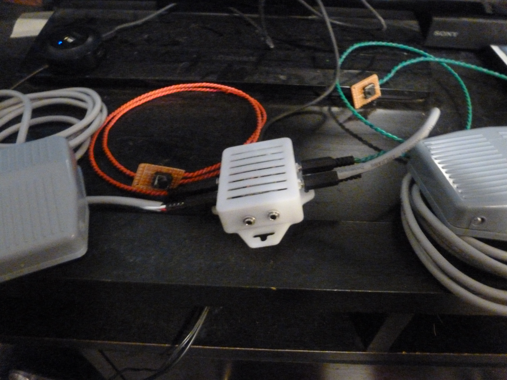

# horse_game_controller

Custom controller for the [Tales of Rein Ravine](https://store.steampowered.com/app/2299740/Tales_of_Rein_Ravine/) game.

A microcontroller acts as a USB device, several switches trigger keyboard and mouse commands to provide inputs for the game.

Left and right rein: "A" and "D" keys.
Seat forward and rear: "W" and "S" keys.
Left and right leg: mouse left and mouse right.

The first pass is using an [Adafruit QT Py RP2040](https://www.adafruit.com/product/4900):
[controller_test_1](controller_test_1.mp4)
]
